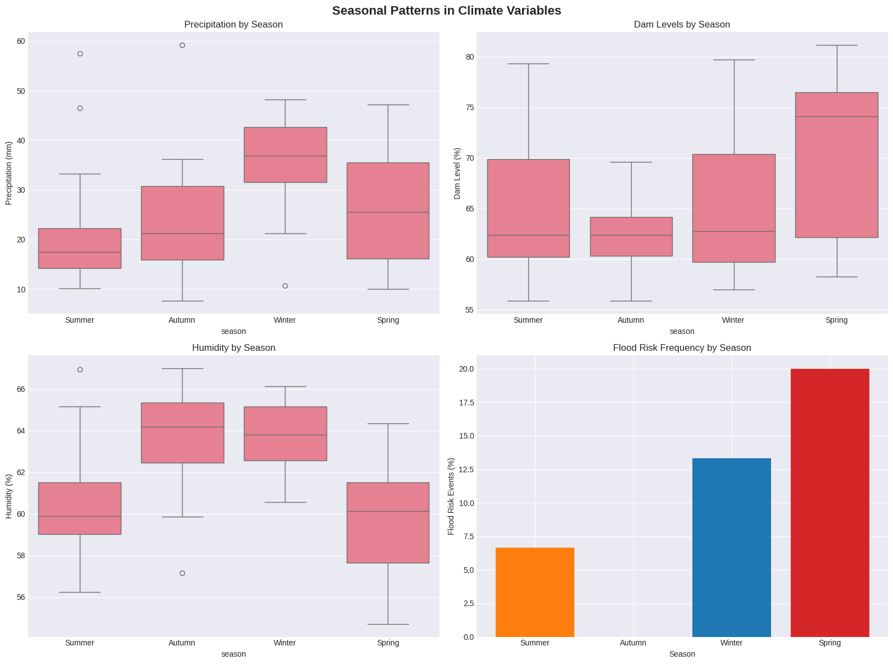
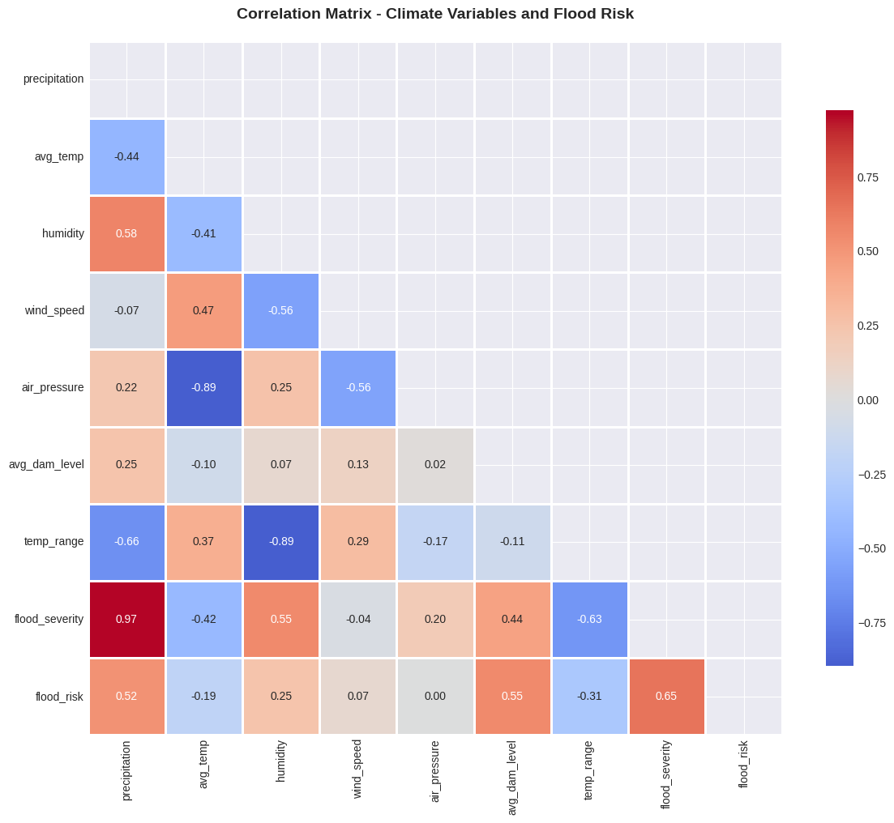
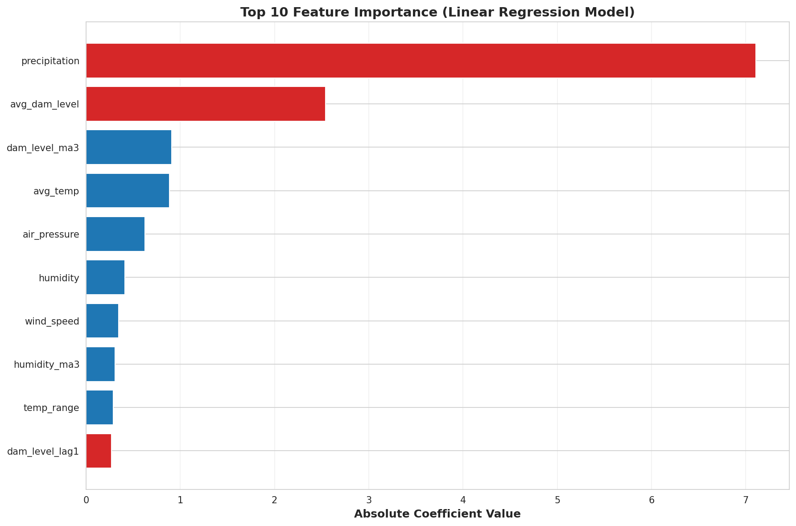
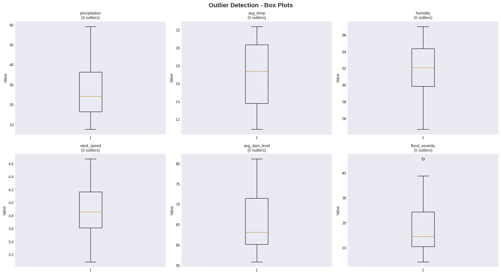
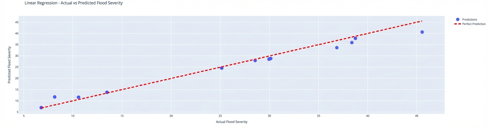
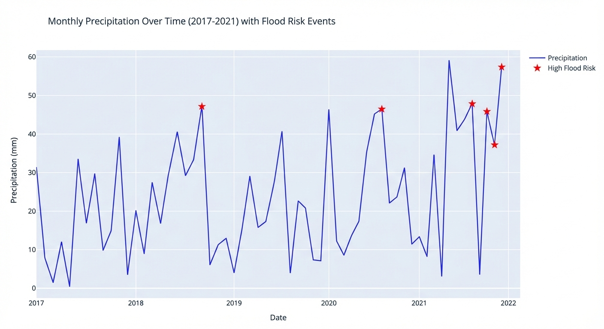
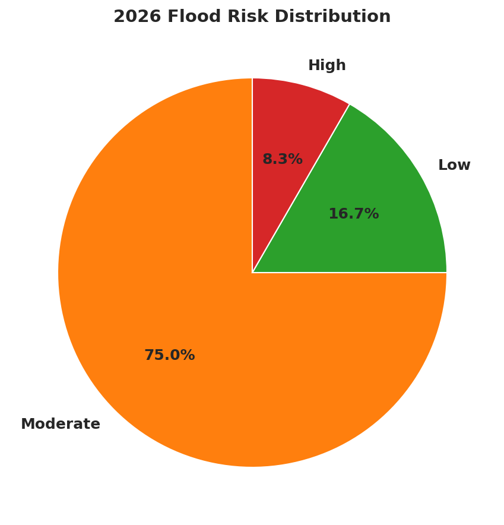
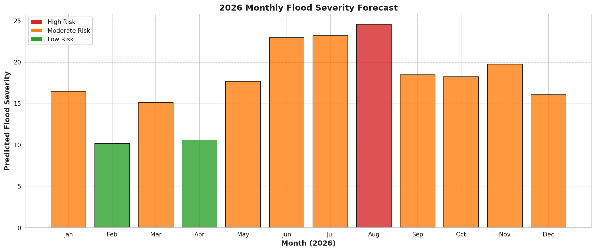
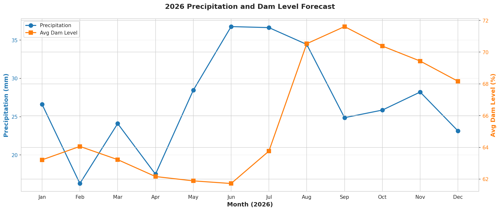

# 🌊 CZR Insurance Group - Flood Risk Prediction Analysis

## 🎯 Project Overview

This repository contains a **comprehensive climate risk assessment** developed for CZR Insurance Group to predict flood risks in the Western Cape region. By analyzing historical climate patterns and dam levels, we've built predictive models to forecast flood frequency and severity, enabling data-driven insurance pricing and strategic capital allocation.

**📅 Analysis Period:** 2017-2021 (60 months of historical data)  
**🔮 Forecast Horizon:** 2026 (12-month predictions)  
**📍 Focus Region:** Western Cape, South Africa

---

## 📊 Key Insights at a Glance

### 🚨 Top Risk Drivers Identified

| Risk Factor | Impact Level | Key Insight |
|-------------|--------------|-------------|
| **Precipitation** | 🟥 Very High | Strongest predictor of floods - higher rainfall directly increases flood severity |
| **Dam Levels** | 🟧 High | Critical threshold at 70%+ capacity significantly increases spillover risk |
| **Humidity** | 🟨 Medium | Indicates atmospheric saturation, contributing to flood conditions |
| **Temperature Range** | 🟩 Low | Negative correlation - stable, cooler temperatures increase flood likelihood |

### 🌧️ Flood Definition & Severity Calculation

**A flood event is identified when:**
- **Rainfall** exceeds the top 25% of historical observations, **AND**
- **Dam levels** are in the top 25% of historical capacity

**Flood Severity Score:**
```
Flood Severity = (Precipitation × Dam Level) ÷ 100
```

*Higher scores indicate more severe potential flooding.*

---

## 📈 Visual Analysis & Insights

### 1. **Seasonal Patterns Analysis** 🌸❄️
**What it shows:** How climate variables change across seasons  
**Key Finding:** Spring has the highest flood risk (20% of events) despite not having the highest rainfall  
**Insight:** Winter rains accumulate in dams, creating a "lag effect" that peaks in spring  


### 2. **Variable Correlation Matrix** 🔗
**What it shows:** Relationships between 8 climate variables and flood risk  
**Key Finding:** Precipitation and flood severity have near-perfect correlation (0.97)  
**Insight:** Rainfall is the primary flood driver, but dam levels and humidity also contribute significantly  


### 3. **Predictor Importance Ranking** 📊
**Absolute Coefficient Value** is a measure of how much the model's flood prediction changes when each input feature (like precipitation or dam level) changes by one unit.
**What it shows:** Which variables most strongly influence flood predictions  
**Top 3 Predictors:**  
1. Precipitation (Impact Score: 7.11)  
2. Average Dam Level (Impact Score: 2.54)  
3. 3-Month Dam Level Average (Impact Score: 0.91)  

Without absolute values


### 4. **Data Quality Check** ✅
**What it shows:** Outlier detection across all measured variables  
**Key Finding:** Only one significant outlier detected (extreme flood event)  
**Insight:** Data quality is excellent, making it reliable for predictive modeling  
**One Outlier:** flood severity


### 5. **Model Validation** ✔️
**What it shows:** How well our predictions match historical data  
**Performance:** Linear Regression explains 96.85% of variance in flood severity  
**Insight:** Model provides highly accurate predictions with minimal overfitting  


### 6. **Historical Trends** 📜
**What it shows:** Climate variable patterns over 5 years  
**Insight:** Identifies recurring seasonal patterns and anomalies for risk assessment  
**Note:** Red markers is when precipitation > 75% and avg dam level > 75%


---
**Used for regularization techniques, respectively, used to prevent overfitting in linear models by adding a penalty to the loss function**
Ridge Regression: Gently penalizes correlated variables
Lasso Regression: Aggressively eliminates redundant variables

## 🤖 Model Performance Comparison

We evaluated five machine learning models to find the most reliable predictor:

| Model | Test Accuracy (R²) | Error Rate (RMSE) | Overfitting Risk | Recommendation |
|-------|-------------------|-------------------|------------------|----------------|
| **📊 Linear Regression** | **96.85%** | **2.26** | **Very Low** | ✅ **BEST CHOICE** |
| **⛰️ Ridge Regression** | 96.62% | 2.34 | Very Low | Good alternative |
| **🎯 Lasso Regression** | 96.59% | 2.35 | Very Low | Good alternative |
| **🌳 Gradient Boosting** | 84.91% | 4.94 | High | ❌ Overfits |
| **🌲 Random Forest** | 81.41% | 5.48 | High | ❌ Overfits |

### 🏆 Why Linear Regression Wins:

- **Highest Accuracy:** Explains 96.85% of flood severity variation
- **Most Reliable:** Minimal difference between training and test performance
- **Interpretable:** Clear coefficients show exactly how each factor affects flood risk
- **Simple & Stable:** Less complex, easier to maintain and explain to stakeholders

---

## 🔮 2026 Flood Forecast - What to Expect

### Monthly Risk Outlook

| Month | Risk Level | Precipitation | Dam Level | Severity Score | Action Required |
|-------|------------|---------------|-----------|----------------|-----------------|
| **August** | 🔴 **HIGH** | 34.4mm | 70.5% | 24.6 | ⚠️ **Highest Alert** |
| July | 🟠 Moderate | 36.6mm | 63.8% | 23.2 | Monitor closely |
| June | 🟠 Moderate | 36.8mm | 61.7% | 23.0 | Standard monitoring |
| September | 🟠 Moderate | 24.9mm | 71.6% | 18.5 | Standard monitoring |
| May | 🟠 Moderate | 28.5mm | 61.9% | 17.7 | Standard monitoring |
| *Other Months* | 🟢 **Low** | <28mm | <70% | <18.0 | Routine observation |

### Risk Distribution for 2026
- **🟢 Low Risk:** 16.7% of months
- **🟠 Moderate Risk:** 75.0% of months  
- **🔴 High Risk:** 8.3% of months (August only)



### 📅 Monthly Forecast Visualizations



---

## 💼 Business Recommendations

### 🏦 Insurance Pricing Strategy
| Risk Level | Premium Adjustment | Months Affected |
|------------|-------------------|-----------------|
| **Low Risk** | Standard pricing | Feb, Apr |
| **Moderate Risk** | +10-15% premium | Jan, Mar, May-Jun, Jul, Sep-Dec |
| **High Risk** | +25-35% premium or coverage limits | **August only** |

### 💰 Capital & Resource Planning
- **Reserve 40% more capital** for Q3 2026
- **Prioritize Western Cape** exposure management
- **Consider reinsurance** for August catastrophic coverage
- **Pre-position claims adjusters** before high-risk periods

### 🛡️ Risk Mitigation Actions
1. **30-day advance alerts** to high-risk policyholders
2. **Enhanced monitoring** of dams exceeding 70% capacity
3. **Install additional sensors** for real-time data collection
4. **Develop early warning system** (7-14 day forecasts)

### 🚀 Model Enhancement Roadmap
- **Short-term (3 mo):** Add real-time weather feeds & soil data
- **Medium-term (6-12 mo):** Expand to 10-year history & vulnerability indices
- **Long-term (1-2 yr):** Incorporate satellite imagery & climate change scenarios

---

## 🚀 Getting Started

### Quick Start (5 Minutes!)
**👉 Read [QUICKSTART.md](QUICKSTART.md) for step-by-step setup instructions!**

### Basic Setup
```bash
# Install required packages
pip install pandas numpy matplotlib seaborn scikit-learn

# Clone and run
git clone https://github.com/imperfectperson-max/absa_casestudy.git
cd absa_casestudy
# Open Absa_CZR_Insurance_Flood_Prediction_Analysis.ipynb in Jupyter/Colab
```

---

## 📁 Output Files Generated

- `CZR_2026_Flood_Forecast.csv` - Monthly predictions
- `CZR_Model_Coefficients.csv` - Feature importance rankings
- `CZR_Model_Comparison.csv` - Model performance metrics

---

## 📚 Documentation Guide

| Document | Purpose | Time Needed |
|----------|---------|-------------|
| `QUICKSTART.md` | First-time setup & running analysis | 5 min ⚡ |
| `README.md` (this file) | Project overview & key insights | 10 min 📖 |
| `INSIGHTS.md` | Deep dive into findings & recommendations | 20 min 🔍 |
| `DATA_DICTIONARY.md` | CSV field definitions & usage | 10 min 📋 |

---

## 👥 Team & Attribution

**Climate Risk Analytics Team - QYF Group 1**  
**Organization:** CZR Insurance Group  
**Analysis Date:** January 30, 2026  
**Contact:** Climate Risk Analytics Team for questions or access requests

---

## 🔗 Quick Access

- [View Full Analysis Notebook](#)
- [Download 2026 Forecast](#)
- [Compare Model Performance](#)
- [See Predictor Rankings](#)

---

*This analysis enables proactive flood risk management through data-driven insights, helping CZR Insurance optimize pricing, allocate capital efficiently, and protect policyholders from climate-related losses.*
